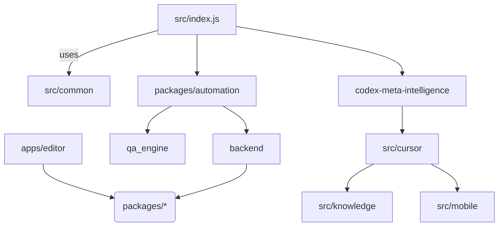

# Knowledge Graph Snapshot

_Last updated: 2024-11-23_

## Node Summaries

- **CLI (`src/`)**: Orchestrates command execution, delegating to automation packages and the Meta
  Intelligence runtime.
- **Automation Packages (`packages/automation`)**: Provides state machines, schema validators, and
  adapters for orchestrating agent workflows.
- **Meta Intelligence (`codex-meta-intelligence`)**: Hosts the next-generation agent architecture,
  including capability registries, analytics, and orchestration logic.
- **Editor (`apps/editor`)**: Next.js front-end backed by shared TypeScript utilities.
- **Cursor Integrations (`src/cursor`, `scripts/auto_setup_cursor.py`)**: Enforce IDE usage, manage
  compliance, and bridge to knowledge systems.
- **Knowledge Services (`src/knowledge`)**: Supplies curated context from NDJSON assets for agents.
- **Mobile Control (`src/mobile`)**: Provides remote orchestration features consumed by automation
  flows.
- **QA Engine (`qa_engine`)**: Runs scenario-based evaluations with shared logging and reporting.
- **Backend (`backend`)**: Express middleware for health checks and service bootstrap.

## Edge Semantics

- **Command Invocation**: CLI triggers automation and Meta Intelligence capabilities.
- **Shared Utilities**: Both front-end and back-end components import TypeScript utilities from
  `packages/` to avoid duplication.
- **Compliance Enforcement**: Meta Intelligence depends on Cursor integration to guarantee agent
  compliance with workspace rules.
- **Telemetry Flow**: Automation modules and Meta Intelligence publish metrics via shared analytics
  modules, consumed by dashboards defined in `docs/architecture.md`.
